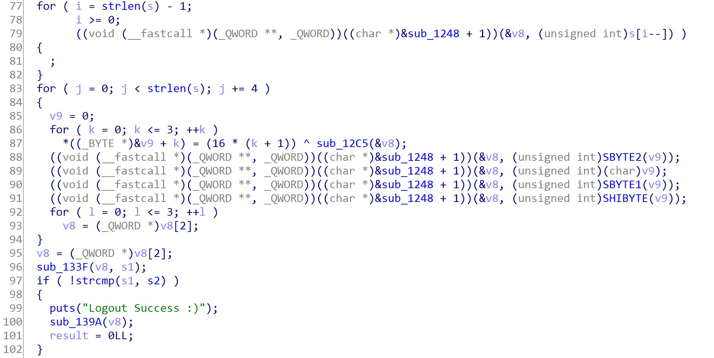

# Link Start

You have a chance to logout if you know the flag.

檔案: [chal](./chal)

## 概觀

下載檔案後，發現是一個 64 位元 ELF

```text
$ file chal
chal: ELF 64-bit LSB pie executable, x86-64, version 1 (SYSV), dynamically linked, interpreter /lib64/ld-linux-x86-64.so.2, BuildID[sha1]=66fdae43943dd9b2f528b584ef3bbc06b071b473, for GNU/Linux 3.2.0, stripped
```

執行發現需要輸入一組 flag，先隨便給 "123" 當作輸入，發現 Failed


### 反編譯

開啟 IDA pro x64，找到 `main` 函式 **F5** 反編譯看程式流程。

發現要求輸入後，會先判斷輸入長度是否等於 44，若不是就跳到 `LABEL_17`


`LABEL_17` 即輸出 Failed 文字的地方


觀察輸入的字串會用到的地方，觀察到其於 `79` 行與 `v8` 一起做為參數使用，`v8` 再於 `83` ~ `95` 行經過一連串迴圈運算，最後與 `s1` 一起做為參數使用 (類似以某種方式將 `v8` 賦值給 `s1` 的感覺)。

最後 `s1` 與 `s2` 比較，相等即輸出 "Success"


### 直覺

為了使程式成功輸出 Success，需要找到一組輸入，使其經過複雜轉換後，與 `s2` 字串相等，此時找到的原始輸入應為 flag。

## 分析
